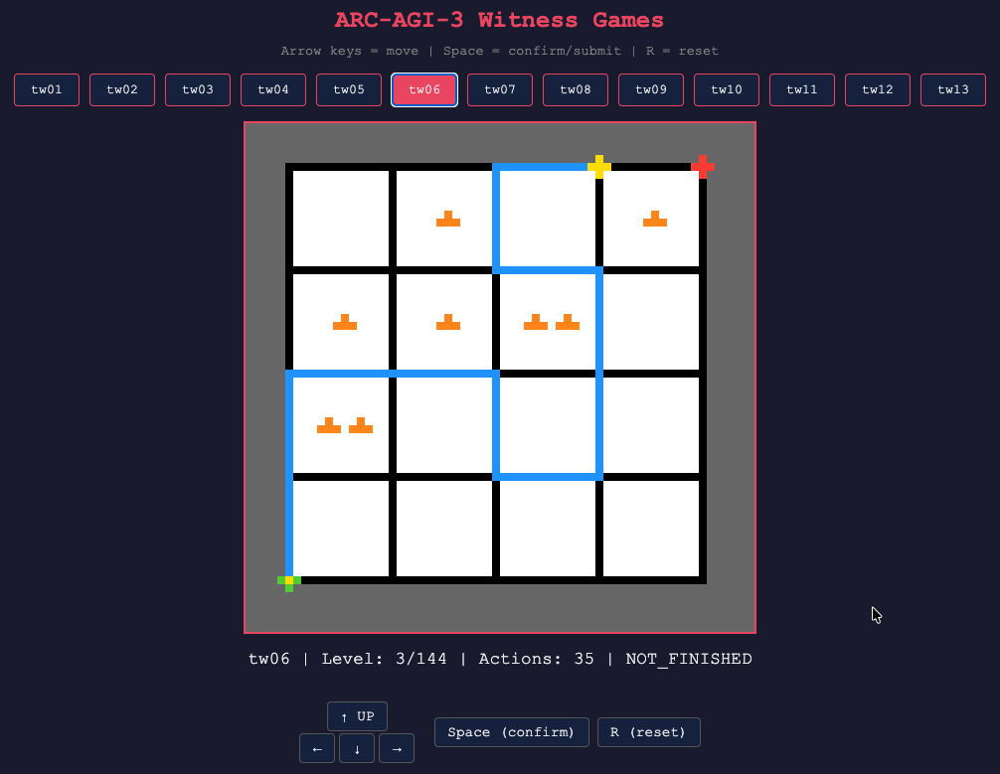

<p align="center">
  
</p>

# arc-witness-envs

Interactive reasoning environments for [ARC-AGI-3](https://arcprize.org/arc-agi/3/), inspired by the puzzle mechanics of [The Witness](https://en.wikipedia.org/wiki/The_Witness_(2016_video_game)).

Built on the official [ARC-AGI SDK](https://docs.arcprize.org) (`arcengine`). Each game renders to a 64x64 pixel grid with a 16-color palette, playable by both AI agents and humans.

**Drop-in compatible with ARC-AGI-3**: All 13 games implement the same `ARCBaseGame` interface as official ARC-AGI-3 environments. Any agent built for the competition can run these games with zero code changes — just point it at this `environment_files/` directory. This gives you 1,872 extra training/evaluation levels across 13 puzzle types to develop and stress-test your agent before the real competition.

**Also RL-ready**: An [OpenEnv](https://github.com/meta-pytorch/OpenEnv) adapter is included for reinforcement learning training (see [OpenEnv Adapter](#openenv-adapter-rl-training) section).

## Why The Witness?

The Witness contains 523+ hand-crafted line-drawing puzzles that teach abstract rules through progressive difficulty — no text, no tutorials. Each puzzle type maps cleanly to ARC-AGI [Core Knowledge](https://arxiv.org/abs/1911.01547) priors:

| Puzzle Mechanic | Game | Core Knowledge |
|---|---|---|
| Hexagon dots (mandatory waypoints) | `tw01` PathDots | Objectness — preserving specific elements |
| Colored squares (region partition) | `tw02` ColorSplit | Objectness + Numbers — classify by attribute |
| Polyomino shapes (exact cover tiling) | `tw03` ShapeFill | Geometry — spatial composition |
| Symmetry (mirrored line drawing) | `tw04` SymDraw | Geometry — symmetry transforms, mental simulation |
| Stars (region pair counting) | `tw05` StarPair | Numbers — counting + classification |
| Triangles (edge counting) | `tw06` TriCount | Numbers — local counting constraints |
| Erasers (error absorption) | `tw07` EraserLogic | Meta-reasoning — constraint violation balancing |
| Squares + Stars (dual constraint) | `tw08` ComboBasic | Composition — multiple simultaneous rules |
| Cylinder wrap (topology) | `tw09` CylinderWrap | Topology — non-planar space |
| Color filters (perception transform) | `tw10` ColorFilter | Perception — transform-then-apply |
| Multi-constraint regions | `tw11` MultiRegion | Composition — 2+ simultaneous region constraints |
| Hex dots + region constraints | `tw12` HexCombo | Composition — path waypoints + region rules |
| Erasers + any constraint | `tw13` EraserAll | Meta-reasoning — generalized error absorption |

## Games

### tw01 — PathDots
Draw a path from start to end that passes through **all** marked waypoints (yellow dots).
- 16 levels (10 validated + 6 unvalidated), progressively harder
- Advanced levels include breakpoints (blocked edges) and multiple start points
- Trains: path planning, constraint satisfaction

### tw02 — ColorSplit
Draw a path that **partitions** the grid into regions where each region contains only one color of square.
- 62 levels (51 validated + 11 unvalidated, up to 3 colors)
- Advanced levels include breakpoints (blocked edges)
- Trains: classification, spatial reasoning, region analysis

### tw03 — ShapeFill
Draw a path that partitions the grid; each region's polyomino pieces must **exactly tile** the region.
- 248 levels (106 validated + 142 unvalidated)
- NP-complete tiling validation, advanced levels include breakpoints
- Trains: spatial composition, geometric reasoning

### tw04 — SymDraw
Control a **blue** line; a **yellow** line mirrors your moves automatically. Both must reach their respective endpoints simultaneously.
- 26 levels (20 validated + 6 unvalidated)
- Symmetry types: horizontal, vertical, 180° rotational
- Advanced levels include breakpoints affecting both paths
- Trains: symmetry transforms, dual-state mental simulation

### tw05 — StarPair
Draw a path that partitions the grid; each region must contain **exactly 2 stars** of each color present.
- 55 levels (46 validated + 9 unvalidated)
- Advanced levels include breakpoints
- Trains: counting, classification, region analysis

### tw06 — TriCount
Each cell with N triangles requires the path to touch **exactly N edges** of that cell.
- 144 levels (126 validated + 18 unvalidated)
- Advanced levels include breakpoints
- Trains: local counting, edge-cell relationship reasoning

### tw07 — EraserLogic
Eraser symbols absorb constraint violations. Each region must have `#erasers == #violations`.
- 502 levels (376 validated + 126 unvalidated) — largest game
- Combines with squares, stars, and triangle constraints; advanced levels include breakpoints
- Trains: meta-reasoning, error balancing

### tw08 — ComboBasic
Simultaneous **ColorSplit** (squares) + **StarPair** (stars) constraints.
- 108 levels (61 validated + 47 unvalidated)
- Advanced levels include breakpoints
- Trains: compositional reasoning, multi-constraint satisfaction

### tw09 — CylinderWrap
PathDots variant where the grid **wraps horizontally** (left edge = right edge).
- 5 hand-crafted levels
- Trains: topological reasoning, wrap-around navigation

### tw10 — ColorFilter
ColorSplit variant where **filter cells** change the perceived color of squares. Constraints apply to perceived colors.
- 5 hand-crafted levels
- Trains: perception transformation, transform-then-apply reasoning

### tw11 — MultiRegion
Draw a path that partitions the grid; each region must satisfy **2 or more** constraint types simultaneously (e.g., squares + triangles, stars + tetris).
- 410 levels (145 validated + 265 unvalidated)
- AND logic: all present constraints must hold per region
- Constraint combinations: sq+tri, sq+tetris, star+tri, star+tetris, tri+tetris, and 3+ combos
- Trains: compositional reasoning, multi-constraint satisfaction

### tw12 — HexCombo
Draw a path through **all hex waypoints** (mandatory dots) that also partitions the grid into valid regions satisfying at least one region constraint.
- 160 levels (4 validated + 156 unvalidated)
- Combines path constraint (hex dots) with region constraints (squares, stars, triangles, tetris)
- Low validation rate due to BFS complexity with dot-tracking + region validation at 3s timeout
- Trains: path planning + region reasoning, dual-objective optimization

### tw13 — EraserAll
Generalization of tw07 EraserLogic — erasers absorb constraint violations from **any** constraint type, including tetris and hex dots.
- 131 levels (61 validated + 70 unvalidated)
- Extends tw07 to support tetris violations (failed exact cover) and hex dot violations
- Per region: `#erasers == #violations` across all constraint types
- Trains: meta-reasoning, generalized error balancing

## Dataset Statistics

### Coverage Summary

| Game | Mechanism | TTWS Classified | Validated | Unvalidated | **Total** | Coverage |
|------|-----------|----------------|-----------|-------------|-----------|----------|
| tw01 | PathDots | 44 | 10 | 6 | **16** | 36.4% |
| tw02 | ColorSplit | 76 | 46 | 16 | **62** | 81.6% |
| tw03 | ShapeFill | 272 | 88 | 160 | **248** | 91.2% |
| tw04 | SymDraw | 210 | 20 | 6 | **26** | 12.4% |
| tw05 | StarPair | 88 | 42 | 13 | **55** | 62.5% |
| tw06 | TriCount | 160 | 118 | 26 | **144** | 90.0% |
| tw07 | EraserLogic | 625 | 359 | 143 | **502** | 80.3% |
| tw08 | ComboBasic | 128 | 56 | 52 | **108** | 84.4% |
| tw09 | CylinderWrap | 0 | 5 | 0 | **5** | hand-crafted |
| tw10 | ColorFilter | 0 | 5 | 0 | **5** | hand-crafted |
| tw11 | MultiRegion | 475 | 145 | 265 | **410** | 86.3% |
| tw12 | HexCombo | 375 | 4 | 156 | **160** | 42.7% |
| tw13 | EraserAll | 142 | 61 | 70 | **131** | 92.3% |
| **other** | pure path | **10** | — | — | **0** | — |
| **Total** | | **2,605** | **959** | **913** | **1,872** | |

> **Validated** levels have solver-verified solutions with action sequences and baseline scores.
> **Unvalidated** levels passed filtering but the solver timed out (NP-hard puzzles). They are playable and marked with an orange "?" indicator. When a human solves one in play_human.py, it is automatically marked as validated.

### TTWS Raw Constraint Distribution

Each puzzle may contain multiple constraint types simultaneously:

| Constraint | Count | Mapped To |
|-----------|-------|-----------|
| tetris (polyomino) | 1,195 | tw03 (solo), tw07/tw08/tw11/tw12/tw13 (combo) |
| stars | 1,177 | tw05 (solo), tw07/tw08/tw11/tw12 (combo) |
| missing_edges | 1,043 | Supported as breakpoints (all games) |
| triangles | 972 | tw06 (solo), tw07/tw11/tw12/tw13 (combo) |
| squares | 936 | tw02 (solo), tw07/tw08/tw11/tw12/tw13 (combo) |
| hex (hexagons) | 809 | tw01 (solo), tw12/tw13 (combo) |
| eliminations | 776 | tw07 (sq/star/tri combo), tw13 (all combos) |
| symmetry | 258 | tw04 |
| No constraints | 5 | — |

### Pipeline Funnel

```
TTWS total puzzles:           2,605   (100%)
 ├─ Classified (tw01-13):     2,595   (99.6%)
 │  ├─ tw01-08:               1,603   (61.5%)
 │  │  └─ Levels generated:   1,161
 │  ├─ tw11 MultiRegion:        475   (18.2%)
 │  │  └─ Levels generated:     410
 │  ├─ tw12 HexCombo:           375   (14.4%)
 │  │  └─ Levels generated:     160
 │  └─ tw13 EraserAll:          142   (5.5%)
 │     └─ Levels generated:     131
 ├─ "other" (pure path):         10   (0.4%)
 └─ Hand-crafted (tw09/10):     +10
───────────────────────────────
 Grand total:   1,872 levels (959 validated + 913 unvalidated)
```

### Major Loss Points

| Bottleneck | Lost | Cause | Status |
|-----------|------|-------|--------|
| ~~"other" unclassified~~ | ~~1,002~~ | ~~Multi-constraint combos (tetris+stars, hex+tetris)~~ | **Resolved** (tw11-13, 10 remaining) |
| ~~missing\_edges rejected~~ | ~~\~400+~~ | ~~Grid engine doesn't support broken edges~~ | **Resolved** (+417 levels) |
| ~~multi-start rejected~~ | ~~\~180~~ | ~~Puzzles with 2+ start points~~ | **Resolved** |
| ~~Solver timeout~~ | ~~\~259~~ | ~~NP-hard puzzles exceed BFS/DFS time limit~~ | **Resolved** (kept as unvalidated) |

### Expansion Opportunities

| Direction | Potential Levels | Effort | Status |
|----------|-----------------|--------|--------|
| ~~Support missing\_edges (broken edges)~~ | ~~\~400+~~ | ~~Medium~~ | **Done** (+417) |
| ~~New games for multi-constraint combos~~ | ~~\~170+~~ | ~~High~~ | **Done** (tw11-13, +701) |
| Re-run pipeline with 15s timeout | ~100+ validated | Low | Optional (improves tw12 validation) |

## Project Structure

```
arc-witness-envs/
├── assets/                   # README images
│   └── icon.png
├── witness_grid.py            # Shared grid renderer (64x64, 16-color)
├── test_games.py              # Automated test suite (959 validated levels)
├── play_human.py              # Local web server for browser play
├── environment_files/         # Game code + metadata (SDK-compatible layout)
│   ├── tw01/
│   │   ├── tw01.py            # PathDots game (ARCBaseGame subclass)
│   │   └── metadata.json
│   ├── tw02/
│   │   ├── tw02.py            # ColorSplit game
│   │   └── metadata.json
│   ├── ...                    # tw03-tw12
│   └── tw13/
│       ├── tw13.py            # EraserAll game
│       └── metadata.json
├── levels/                    # Level configs with verified solutions
│   ├── tw01_levels.json       # 16 levels (10v + 6u)
│   ├── tw02_levels.json       # 62 levels (51v + 11u)
│   ├── tw03_levels.json       # 248 levels (106v + 142u)
│   ├── tw04_levels.json       # 26 levels (20v + 6u)
│   ├── tw05_levels.json       # 55 levels (46v + 9u)
│   ├── tw06_levels.json       # 144 levels (126v + 18u)
│   ├── tw07_levels.json       # 502 levels (359v + 143u)
│   ├── tw08_levels.json       # 108 levels (56v + 52u)
│   ├── tw09_levels.json       # 5 levels (hand-crafted)
│   ├── tw10_levels.json       # 5 levels (hand-crafted)
│   ├── tw11_levels.json       # 410 levels (145v + 265u)
│   ├── tw12_levels.json       # 160 levels (4v + 156u)
│   └── tw13_levels.json       # 131 levels (61v + 70u)
├── openenv_adapter/           # OpenEnv RL training adapter
│   ├── models.py              # Action/Observation Pydantic models
│   ├── client.py              # WebSocket client (EnvClient subclass)
│   ├── openenv.yaml           # OpenEnv manifest
│   └── server/
│       ├── witness_environment.py  # Environment wrapper (ARCBaseGame → OpenEnv)
│       └── app.py             # FastAPI entry point
└── converters/                # Puzzle extraction pipeline
    ├── unified_puzzle.py      # Intermediate data model + classifier
    ├── ingest_ttws.py         # Decode protobuf puzzles from ttws
    ├── filter.py              # Classify & filter by game type + grid size
    ├── to_level_config.py     # Convert to game-native level configs
    ├── validate.py            # BFS/DFS solver + baseline calibration
    ├── run_pipeline.py        # One-command extraction pipeline
    └── vendor_ttws/           # Community puzzle data (barrycohen/ttws)
```

## Quick Start

### Install

```bash
pip install arc-agi
```

### Play in Browser

```bash
cd arc-witness-envs
python play_human.py
# Open http://localhost:8001
```

### Use Programmatically

```python
from arcengine import GameAction, ActionInput
from environment_files.tw01.tw01 import Tw01

game = Tw01(seed=0)

UP, DOWN, LEFT, RIGHT, CONFIRM = (
    GameAction.ACTION1, GameAction.ACTION2,
    GameAction.ACTION3, GameAction.ACTION4,
    GameAction.ACTION5,
)

# Play level 1: navigate to collect all dots, then confirm
for action in [RIGHT, RIGHT, UP, LEFT, LEFT, UP, RIGHT, RIGHT, CONFIRM]:
    frame = game.perform_action(ActionInput(id=action), raw=True)

print(f"Levels completed: {frame.levels_completed}")
print(f"State: {frame.state}")  # GameState.PLAYING or GameState.WIN
```

### Run Tests

```bash
python test_games.py
# 13/13 games, 959 validated levels verified (913 unvalidated skipped)
```

### Re-extract Levels

```bash
cd converters
python run_pipeline.py --keep-all
```

Pipeline: decode protobuf -> classify by game type -> convert coordinates -> solve with BFS/DFS -> calibrate baselines -> export JSON. Unsolved puzzles are kept as unvalidated levels.

### Use with Your ARC-AGI-3 Agent

If you already have an agent built for the ARC-AGI-3 competition, just point it at this repo's `environment_files/` directory — no code changes needed:

```python
from arc_agi import Arcade, OperationMode

arcade = Arcade(
    operation_mode=OperationMode.OFFLINE,
    environments_dir="path/to/arc-witness-envs/environment_files",
)

# Your agent sees tw01-tw13 exactly like official ARC-AGI-3 games
for env_info in arcade.get_environments():
    print(env_info.game_id, env_info.title)

scorecard_id = arcade.create_scorecard(tags=["witness"])
env = arcade.make(game_id="tw03", scorecard_id=scorecard_id)
obs = env.reset()

# ... run your agent as usual ...
```

Or serve them via the SDK's REST API for remote agents:

```python
arcade = Arcade(
    operation_mode=OperationMode.OFFLINE,
    environments_dir="path/to/arc-witness-envs/environment_files",
)
arcade.listen_and_serve(port=8001)
# Your agent connects to http://localhost:8001/api/cmd/ACTION1 etc.
```

## Architecture

All games inherit from `ARCBaseGame` and follow the SDK contract:

```
ARCBaseGame
├── __init__()    → create Level objects with Sprites
├── on_set_level() → initialize game state for current level
├── step()        → process one GameAction, update display
└── next_level()  → advance on correct solution
```

Rendering flows through `WitnessGrid`:

```
WitnessGrid(cols, rows)
├── render_grid()           → 64x64 int[][] (color indices)
├── draw_path_segment()     → render path between nodes
├── draw_dot() / draw_start() / draw_end()
├── draw_cell_symbol()      → colored squares in cell centers
├── draw_star()             → diamond-shaped star symbols
├── draw_triangle()         → 1-3 small triangles per cell
├── draw_polyomino()        → tetris piece preview
├── draw_eraser()           → Y-shaped eraser symbol
├── draw_breakpoint()       → gap on blocked edge between nodes
├── draw_unvalidated_indicator() → orange "?" for unverified levels
├── path_splits_regions()   → BFS region extraction
└── cell_edge_count()       → count path edges touching a cell
```

### Coordinate System

- **Nodes**: `(col, row)` in `[0, cols] x [0, rows]` — path intersections
- **Cells**: `(col, row)` in `[0, cols-1] x [0, rows-1]` — spaces between nodes
- **Pixels**: 64x64 grid, nodes rendered as 1px dots, edges as 1px lines

### Action Space

| Action | ID | GameAction |
|---|---|---|
| Up | 1 | `ACTION1` |
| Down | 2 | `ACTION2` |
| Left | 3 | `ACTION3` |
| Right | 4 | `ACTION4` |
| Confirm | 5 | `ACTION5` |

## OpenEnv Adapter (RL Training)

The `openenv_adapter/` module wraps all 13 games as [OpenEnv](https://github.com/meta-pytorch/OpenEnv) environments for RL training, while the game implementations remain fully ARC-AGI-3 SDK compatible.

```
┌─────────────────────────────────────────────┐
│          tw01-tw13 (ARCBaseGame)            │  ← game logic, untouched
├──────────────────┬──────────────────────────┤
│  ARC-AGI-3 SDK   │     OpenEnv Adapter      │  ← two independent interfaces
│  Arcade.make()   │  Environment subclass    │
│  play_human.py   │  models.py / client.py   │
│  test_games.py   │  openenv.yaml            │
└──────────────────┴──────────────────────────┘
```

### Design

- **Episode = one level**: `reset()` starts (or restarts) the current level; the episode ends when the level is solved or truncated
- **Observation**: 64x64 int grid (color indices 0-15) + level metadata
- **Action**: discrete 1-5 (UP/DOWN/LEFT/RIGHT/CONFIRM)
- **Truncation**: `max_steps = baseline × 3`

#### Reward Modes (`reward_mode` / `WITNESS_REWARD`)

| Mode | Solve | Step | Wrong CONFIRM | Best for |
|------|-------|------|---------------|----------|
| `sparse` | +1.0 | 0 | 0 | Exploration-heavy algorithms (RND, ICM) |
| `shaped` (default) | +1.0 | -0.01 | -0.1 | PPO, SAC — solve always net positive |
| `arc_score` | min(baseline/steps, 1) | 0 | -0.1 | Directly mirrors ARC-AGI-3 scoring |

Key property: **solving a level is always a positive reward signal**, regardless of how many steps it took. This avoids the failure mode where step penalties drown out the solve signal when the agent is slower than baseline (which is the common case).

### Install

```bash
pip install arc-agi openenv
```

### Start Server

```bash
cd arc-witness-envs

# Serve tw01 (default)
uvicorn openenv_adapter.server.app:app --host 0.0.0.0 --port 8000

# Serve a specific game with specific reward mode
WITNESS_GAME=tw03 WITNESS_REWARD=arc_score uvicorn openenv_adapter.server.app:app --port 8000
```

### Use Client

```python
import asyncio
from openenv_adapter.client import WitnessEnvClient
from openenv_adapter.models import WitnessAction, WitnessGameAction

async def main():
    client = WitnessEnvClient(base_url="ws://localhost:8000")
    async with client:
        result = await client.reset()
        print(f"Level: {result.observation.level_index}")

        for action in [WitnessGameAction.RIGHT, WitnessGameAction.UP, WitnessGameAction.CONFIRM]:
            result = await client.step(WitnessAction(action=action))
            print(f"Reward: {result.reward}, Done: {result.done}")

asyncio.run(main())
```

### Use Directly (No Server)

```python
from openenv_adapter.server.witness_environment import WitnessEnvironment
from openenv_adapter.models import WitnessAction, WitnessGameAction

env = WitnessEnvironment(game_id="tw01", seed=0)
obs = env.reset()

obs = env.step(WitnessAction(action=WitnessGameAction.RIGHT))
print(f"Reward: {obs.reward}, Done: {obs.done}")
print(f"Frame shape: {len(obs.frame)}x{len(obs.frame[0])}")  # 64x64
```

## ARC-AGI-3 Context

This repository provides **training environments** for the [ARC-AGI-3 competition](https://arcprize.org/arc-agi/3/) — the first Interactive Reasoning Benchmark (IRB). Agents must:

1. **Explore** — discover game rules through interaction (no instructions provided)
2. **Learn** — infer abstract constraints from visual feedback
3. **Plan** — solve increasingly difficult levels within an action budget

Scoring: `score = max(0, 1 - actions_taken / baseline_actions)` per level, averaged across all levels.

## License

The game implementations and extraction pipeline are original work. Level data is derived from community contributions to [The Witness](https://store.steampowered.com/app/210970/The_Witness/) puzzle ecosystem via the [ttws](https://github.com/barrycohen/ttws) project.

## Author

**Guanghan Ning** — Independent AI researcher, Bay Area. PhD in ECE, former ByteDance Seed-Code LLM research scientist.
