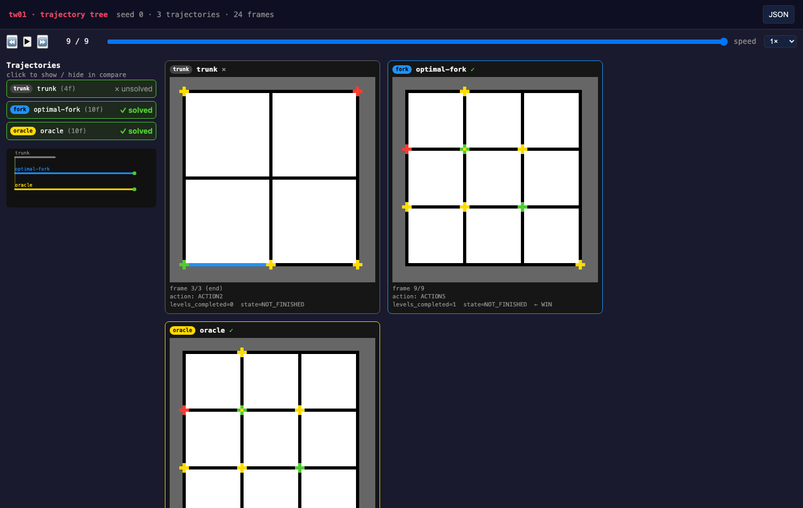

<div align="center">
  <h1>🔍 oversight</h1>
  <p><b>An oversight toolbox for <a href="https://arcprize.org/arc-agi/3/">ARC-AGI-3</a> witness environments</b><br>
  <b>Snapshot · fork · oracle · visualize — agent-agnostic, bench-safe, removable</b></p>
</div>

<p align="center">
  <a href="https://opensource.org/licenses/MIT"></a>
  <a href="https://www.python.org/"></a>
  <a href="#testing"></a>
  <a href="#architecture"></a>
  <a href="#architecture"></a>
</p>

<p align="center">
  
  <br><sub>The trajectory-tree viewer: a trunk run (left, unsolved) beside the optimal fork and the oracle ghost (both solved).</sub>
</p>

<p align="center">
  Part of <a href="../README.md"><b>arc-witness-envs</b></a> &bull; built on the official <a href="https://docs.arcprize.org">ARC-AGI SDK</a>
</p>

---

`oversight/` turns the witness gym from a **black-box RL environment** into one you can **stop, rewind, branch, and check against ground truth** — the difference between watching an agent fail and understanding *why*.

It is a thin layer of engine-level primitives over the bare `ARCBaseGame`:

```
snapshot(game)        capture full state          → start an agent anywhere in a trajectory
fork(game) / branch   explore counter-factuals    → "what if it had gone left here?"
WitnessOracle         ground-truth solutions      → study the agent with the answer held fixed
export_tree           trajectory-tree artifact    → see trunk vs forks vs optimal, side by side
```

Everything here is **agent-agnostic** (it needs only a game object), **import-optional** (delete the folder and bench scoring is byte-for-byte identical), and **never on the Kaggle/inference path**.

### Highlights

- **Snapshot / restore** any mid-trajectory state — frame-exact, across level boundaries, in-place (object identity preserved).
- **Counter-factual fork & branch** — clone a state into independent timelines without touching the live game.
- **Oracle** — optimal `solution_actions`, scoring baselines, LLM-free state-value, and hand-written rule cards for all 13 games; a solver-backed coverage booster.
- **Trajectory-tree visualization** — a schema-3.0 artifact rendered by the companion `arc_visualizer` repo: trunk + forks + oracle ghost, synced side-by-side.
- **Bench-safe by construction** — composes *under* the benchmark's reset counter; the snapshot target is always the bare game, so scorecards/counters are structurally excluded.
- **A transferable pilot** — the four capabilities are exposed as generic `Protocol`s; a second RL environment inherits oversight by implementing the subset it can satisfy.

---

## 📝 Contents

- [Quick Start](#quick-start)
- **Core capabilities**
  - [1 · Snapshotting](#snapshotting)
  - [2 · Counter-factual Retry](#counter-factual-retry)
  - [3 · Oracle](#oracle)
  - [4 · Visualization](#visualization)
- [Interactive oversight (browser)](#interactive)
- [Using it from training & eval](#consumers)
- [Architecture & safety guarantees](#architecture)
- [Testing](#testing)
- [Transferable-pilot generalization](#transferable)

<a id="quick-start"></a>

## 🚀 Quick Start

### Install

The toolbox needs the ARC-AGI SDK (which ships `arcengine`) and the parent repo on the path:

```bash
pip install arc-agi          # provides `arcengine`
# `oversight` is a top-level package inside arc-witness-envs; importing `bench`
# already puts the repo root on sys.path, so `import oversight` just works.
```

> Run from the **repo root** (or `pip install -e .` the parent) so `oversight` and `bench` resolve.

### 60-second tour

```python
from bench.catalog import load_game          # the witness game loader
from oversight import snapshot, restore, fork, branch, WitnessOracle

game = load_game("tw07", seed=0)             # EraserLogic — the largest game

# 1) SNAPSHOT — capture the current state
snap = snapshot(game)

# 2) BRANCH — explore a counter-factual on a *fork*; the live game is untouched
result = branch(game, [1, 4, 2, 5], from_snapshot=snap)   # illustrative actions
print(result.final_state, result.levels_completed[-1])

# 3) ORACLE — ask for ground truth
acts, status = WitnessOracle().solution("tw07", level=0)
print(status.value, acts)                    # "validated_optimal" [.., 5]

# 4) RESTORE — rewind the live game to the snapshot, exactly
restore(game, snap)
assert snapshot(game).frame_hash == snap.frame_hash
```

> **Running it:** any Python with `arc-agi` installed works. Tests run under the project's venv: `python -m pytest oversight/` (see [Testing](#testing)).

---

<a id="snapshotting"></a>

## 1 · Snapshotting

Capture the **complete** mutable state of a game and restore it later — letting an agent (or an analyst) start from *anywhere* in a trajectory, not just a clean level start.

```python
from oversight import snapshot, restore, Snapshot

snap = snapshot(game, label="before the risky move")
snap.sid          # content id (sha256 over game_id|level|score|action_count|state|frame_hash)
snap.frame_hash   # sha256 of the rendered 64x64 frame at capture
snap.level_index, snap.score, snap.state

# … play many actions, cross level boundaries …

restore(game, snap)                 # in-place: the SAME object is rewound
restore(game, snap, verify=True)    # also re-render and assert the frame matches
```

- **Frame-exact & deterministic** across all 13 witness games (they carry no RNG — only a `seed` int).
- **In-place restore** (`__dict__.clear()+update`) preserves object identity, so a held reference (e.g. a reward function reading `game._path`) stays valid. Engine `RESET` is *not* used — it can only reach a clean level/game start, never an arbitrary mid-trajectory state.
- A snapshot is reusable: `restore` deep-copies *out* of it, so the snapshot stays pristine.
- **Typed failures:** `snapshot` raises `SnapshotCaptureError` (naming any un-deepcopyable member); `restore` raises `SnapshotVersionMismatch` across an arcengine version boundary, or `RestoreVerificationError` under `verify=True` if the re-rendered frame disagrees.

<details>
<summary><strong>Why deepcopy, not pickle</strong> (a real arcengine quirk)</summary>

Snapshots are backed by an in-memory `deepcopy(game.__dict__)`, not a pickle blob. arcengine's `GameAction` enum does **not** round-trip through pickle — its members carry tuple values but reassign `_value_` in `__init__`, so `GameAction(0)` is invalid (the SDK ships `from_id`/`from_name` for exactly this reason), and a game's `_action` holds a `GameAction`. `deepcopy` is unaffected (enum members copy by identity). Disk persistence for a frozen *moment library* would need a custom `GameAction` reducer; the in-memory primitives here do not.
</details>

<a id="counter-factual-retry"></a>

## 2 · Counter-factual Retry (fork / branch)

Clone a state into **independent** timelines to explore alternative paths — the foundation for failure bisection, Go-Explore restarts, and process-reward estimation.

```
         ● snapshot
         │
live  ───┴── a ─ b ─ …            the live game — never mutated
         │
fork  ───└── x ─ y ─ ✓            branch(): an independent timeline
```

```python
from oversight import fork, is_forked, branch

child = fork(game)                  # an independent deepcopy; game and child never share state
is_forked(child), is_forked(game)   # (True, False)

# `branch` is the workhorse: replay an action list on a fork (optionally from a
# snapshot) and get a viewer-ready trajectory back — the live game is never mutated.
res = branch(game, [4, 4, 1, 3, 5], from_snapshot=snap)
res.frames                # one rendered frame per action (raw ndarrays)
res.levels_completed      # per-step levels_completed
res.states                # per-step GameState
res.final_state, res.final_levels_completed
```

- A fork's "forked" flag lives in a module-level `WeakSet` **off** the game's `__dict__`, so it never rides through a snapshot onto a live scored game.
- Forks refuse to write real scorecards / bench counters and carry no bound agent — they are pure off-trajectory objects.

<a id="oracle"></a>

## 3 · Oracle

Ground truth, almost for free: the level packs already ship an **optimal, CONFIRM-terminated** `solution_actions` for every validated level. The oracle exposes that plus baselines, rule cards, and an LLM-free state-value probe.

```python
from oversight import WitnessOracle, SolutionStatus

orc = WitnessOracle()
acts, status = orc.solution("tw07", level=0)        # ([…, 5], SolutionStatus.VALIDATED_OPTIMAL)
orc.optimal_moves("tw07", 0)                        # solver-proven shortest move count
orc.baseline("tw07", 0, source="bench")             # the per-level scoring budget (metadata.json)
orc.baseline("tw07", 0, source="optimal")           # the optimal-derived baseline
orc.rule_card("tw07")                               # hand-written ground-truth rules (markdown)
orc.coverage()                                      # per-game validated / handcrafted / total

# LLM-free value estimate: fork from a snapshot + seeded random rollouts
est = orc.state_value(snap, rollouts=32, seed=0)
est.success_rate, est.n_wins, est.informative      # informative=False on hard region games (honest 0)
```

`solution()` returns a **typed status** so callers never mistake sparse coverage for failure:

| status | meaning |
|---|---|
| `VALIDATED_OPTIMAL` | solver-proven shortest path |
| `HANDCRAFTED_EXAMPLE` | replays to a win, not proven optimal (tw09 / tw10 — no solver) |
| `UNKNOWN` | config-only level, no stored solution |

<details>
<summary><strong>Per-game oracle coverage</strong> (and how to lift it)</summary>

Coverage is lumpy — `coverage()` reports it per game so you never hide it behind the 949 aggregate:

| game | validated/total | note |
|---|---|---|
| tw01 | 10/16 | |
| tw02 | 46/62 | |
| **tw03** | **88/248** | solver-timeout-limited |
| tw04 | 20/26 | dual-path |
| tw05 | 42/55 | |
| tw06 | 118/144 | |
| tw07 | 359/502 | |
| tw08 | 56/108 | |
| tw09 | 0/5 | no solver — handcrafted only |
| tw10 | 0/5 | no solver — handcrafted only |
| **tw11** | **145/410** | solver-timeout-limited |
| **tw12** | **4/160** | worst-covered; has a BFS solver — pure timeout |
| tw13 | 61/131 | |

> **949 vs 959:** the **949** here is the live solver-validated-optimal total across all 13 games. The parent README's **959** is a slightly stale aggregate (it folds in the 10 hand-crafted tw09/tw10 levels, which have no solver); `coverage()` is the source of truth.

Lift coverage on the weak games with a longer offline solver budget:

```bash
python -m oversight.batch_resolve --game tw12 --timeout 30 --persist   # one game
python -m oversight.batch_resolve --all --timeout 20                    # dry-run all 13
```

Dry-run by default; `--persist` writes `solution_actions` / `moves` / `baseline` / `validated` back into `levels/<game>_levels.json`. tw09/tw10 have no solver and are skipped.
</details>

<a id="visualization"></a>

## 4 · Visualization

Render a **trajectory tree** — a trunk run, its counter-factual fork branches, and an optional oracle ghost — as a self-contained artifact that the companion `arc_visualizer` tree viewer displays side-by-side.

```python
from oversight import export_tree

export_tree(
    out_dir="/tmp/tree",
    game_id="tw01", seed=0,
    trunk_actions=[4, 2, 2],                                      # the recorded (maybe wrong) run
    branches=[(0, [4,4,1,3,3,1,4,4,5], "optimal")],              # (branch_point, actions, label)
    oracle_actions=[4,4,1,3,3,1,4,4,5],                          # ghost overlay
)
# → /tmp/tree/{tree.json, frames.bin}  (schema 3.0)
```

View it (the viewer is shipped by `arc_visualizer`, which also has an engine-backed `build_tree` producer):

```bash
python -m http.server -d /tmp/tree 8137     # then open http://localhost:8137/tree.html
```

<details>
<summary><strong>Schema 3.0</strong> — the multi-trajectory artifact</summary>

`tree.json` carries a top-level `trajectories[]`, each `{id, kind: trunk|fork|oracle, parent_id, branch_point_frame, frame_start, n_frames, actions, levels_completed, states, solved, label}`. Frames are concatenated row-major into `frames.bin` (`uint8`, `n_frames × 64 × 64`); each trajectory reads its slice via `frame_start`/`n_frames`. The viewer offers a trajectory-tree sidebar, an SVG branch diagram, synced multi-canvas compare, and a WIN highlight. `arc_visualizer.build_tree` produces the identical schema via the deterministic replay engine (with divergence checks) — `export_tree` is the dependency-free in-repo producer.
</details>

<a id="interactive"></a>

## 🖱️ Interactive oversight (browser)

Opt-in HTTP routes let you snapshot / fork / restore / step a game live from the browser, on top of the human-play server. **Off by default** (they widen the public surface near the Kaggle boundary):

```bash
WITNESS_OVERSIGHT_ROUTES=1 python play_human.py
# POST /api/oversight/load   {game_id, seed}      -> {session, grid, frame_hash, …}
#      /api/oversight/step    {session, action}
#      /api/oversight/snapshot{session}            -> {sid}
#      /api/oversight/restore {session, sid}
#      /api/oversight/fork    {session}            -> new independent session
```

These run a *server-side oversight game* (via `bench.catalog`), independent of the SDK play env. Snapshot sids live **in-process** (the registry isn't persisted), so they're valid for the server's lifetime only.

<a id="consumers"></a>

## 🤝 Using it from training & eval

The primitives above are **agent-agnostic**. The agent-coupled layer — injecting ground truth into a live agent, enforcing eval fairness, and driving oversight-aware rollouts — lives downstream in **`arc-witness-agent/agent/oversight/`** and *imports* this package.

<details>
<summary><strong>What the downstream consumer adds</strong> (arc-witness-agent)</summary>

> Imported as `from agent.oversight import …` — shipped by **arc-witness-agent**, *not* this package (so `from oversight import inject_rules` will fail; that's by design — these need a live `AgentCore`). `inject_percept` requires an `AgentCore` whose perceptor (`_compact`) is built.

| capability | API | purpose |
|---|---|---|
| Rule injection | `inject_rules(agent, rules)` | push GT rules into WorkingMemory, tainted `oracle_injected` |
| Percept injection | `inject_percept(agent, {"_path": …})` | override the agent's perceived ground truth (no-op-safe overlay) |
| Fairness guard | `assert_l0_clean(agent)` | refuse to score an agent carrying injected knowledge (wired into both eval entry points) |
| Session | `bind_agent(env).inject_rules(…)` / `.export_tree(…)` | one handle binding env↔agent; renders session branches to a tree |
| Rollout controller | `WitnessRolloutController(env, driver)` | env-side training rollout: reset==restore, Go-Explore, **LLM-free** fork process-reward |
| Trace provenance | `current_snapshot_id(env)` | stamp traces with a reproducible snapshot id |

The fairness rule: anything trained or aided by oversight is **evaluated bare**. The guard catches the *runtime* knowledge channel — not priors internalized into weights (a documented limitation, not over-claimed).
</details>

<a id="architecture"></a>

## 🏗️ Architecture & safety guarantees

```
arc-witness-agent  ─────────────────────────┐  (consumer: inject / discipline / rollout)
        │ imports                            │
        ▼                                    │
arc-witness-envs / oversight  ◄──────────────┘  (THIS package — agent-agnostic primitives)
        │ wraps the bare
        ▼
arcengine.ARCBaseGame   (snapshot target — holds no scorecard / reset counter)
```

The snapshot target is **always** the bare `ARCBaseGame`, reached through one chokepoint, `resolve_root_game()`. Under the benchmark it composes **inside** the reset counter:

```python
_ResetCountingGame(OversightEnv(bare))   # OversightEnv is a transparent passthrough
```

This makes the safety properties **structural**, not conventions:

- **Byte-identical scoring** — `OversightEnv` forwards `perform_action` verbatim; the reset counter and SDK `ScorecardManager` live *outside* the snapshot subtree.
- **Removable** — `bench/runner.py` imports `OversightEnv` under `try/except ImportError`; delete `oversight/` and the runner falls back to identity, with scoring unchanged. A subprocess test proves it.
- **Never on the inference path** — nothing here is imported by the Kaggle/gateway code; a tripwire asserts no `oversight` symbol leaks into the OpenEnv contract.

<details>
<summary><strong>Acceptance gates</strong> (what the test suite enforces)</summary>

| gate | check | scope |
|---|---|---|
| A | snapshot → corrupt → restore → replay == fresh; two fresh runs identical; post-restore RESET deterministic | all 13 games |
| B | fork / snapshot isolation (mutating one never perturbs the other) | all 13 games |
| L9 | a fork's "forked" flag never rides through snapshot→restore onto a live game | — |
| C/D/F | `OversightEnv` is transparent: identical frames, identical reset count, attrs reach the bare game through both proxy layers | all 13 games |
| G | `solution()` status + replays-to-solved | all validated + handcrafted + config-only |
| H | `baseline("bench")` == `metadata.json` | sampled |
| V | `state_value` respects multi-start + breakpoints; reports `informative=False` (not a misleading 0) on hard games | tw07/tw11/tw13 |
| R1 | delete the package → bench imports + scoring unchanged (subprocess) | — |
</details>

<details>
<summary><strong>Module layout</strong></summary>

```
oversight/
├── __init__.py        # public API re-exports
├── resolve.py         # resolve_root_game() chokepoint + register_unwrap() hook
├── snapshot.py        # Snapshot dataclass, snapshot(), restore() (deepcopy-backed)
├── fork.py            # fork(), is_forked(), branch(), BranchResult
├── env.py             # OversightEnv — transparent passthrough that enters the bench stack
├── oracle.py          # WitnessOracle (+ .batch_resolve), SolutionStatus, ValueEstimate
├── viewer_export.py   # export_tree() — schema-3.0 tree.json + frames.bin
├── web_routes.py      # opt-in /api/oversight/* Flask routes
├── batch_resolve.py   # CLI: lift oracle coverage with the IDDFS solver
├── protocols.py       # Snapshottable / Forkable / Oracle / Visualizable (the transferable seam)
├── rule_cards/        # tw01.md … tw13.md (+ _common.md) — hand-written ground-truth rules
└── tests/             # determinism · bench-safety · oracle · viz-export · web-routes
```
</details>

<a id="testing"></a>

## 🧪 Testing

```bash
# this package (97 tests): determinism ×13, bench byte-identity ×13, oracle, viz export, web routes
python -m pytest oversight/ -q

# prove scoring is unchanged with the package present
python -m pytest bench/tests/ -q

# validate a tree artifact
python -m arc_visualizer._validate --root /tmp/tree --tree
```

> Tests load real games via `bench.catalog` and need `arc-agi` installed (for `arcengine`). The web-route tests skip automatically if Flask is absent.

<a id="transferable"></a>

## 🧭 Transferable-pilot generalization

This toolbox doubles as a pilot for **general RL-environment oversight**. The four capabilities are exposed as `typing.Protocol`s in `protocols.py`, and degrade gracefully — a second environment inherits oversight by implementing the subset it can satisfy:

| protocol | witness impl | a 2nd env must… | minimum |
|---|---|---|---|
| `Snapshottable` | generic `deepcopy(__dict__)` | meet the snapshot precondition (below) | required |
| `Forkable` | generic `deepcopy` + WeakSet flag | same precondition | required |
| `Oracle` | level JSON + IDDFS solver | optional — return `UNKNOWN`/empty if no ground truth | optional |
| `Visualizable` | `camera.render` + replay | provide `render() → ndarray` | viz-only |

- **Snapshot precondition:** instance state must be pure-Python and pickle/deepcopy-safe — no live handles, sockets, or C-extension state. Witness satisfies this trivially.
- **Pluggable unwrap:** `register_unwrap(predicate, getter)` lets a non-witness wrapper declare its own path to the bare game, so `resolve_root_game` is not hard-wired.
- **Be honest about the oracle:** an env with no solver/solutions reduces to `state_value`-via-rollout, which is uninformative on hard envs — the oracle is a *capability hook*, not a guarantee.

---

## 🔗 Part of arc-witness-envs

This is the **oversight layer** of [arc-witness-envs](../README.md) — see the parent README for the 13-game catalog, dataset stats, the OpenEnv RL adapter, news, and contributing guidelines. Issues and PRs that touch oversight are welcome there; please keep the [safety guarantees](#architecture) (removability, byte-identical scoring, never-on-inference-path) intact.

## 📖 Citation

```bibtex
@software{ning2026arcwitness,
  author = {Ning, Guanghan},
  title  = {arc-witness-envs: Witness-Inspired Puzzle Environments for ARC-AGI-3},
  year   = {2026},
  url    = {https://github.com/Guanghan/arc-witness-envs},
}
```

## ⚖️ License

[MIT](https://opensource.org/licenses/MIT) — same as the parent [arc-witness-envs](../README.md).
